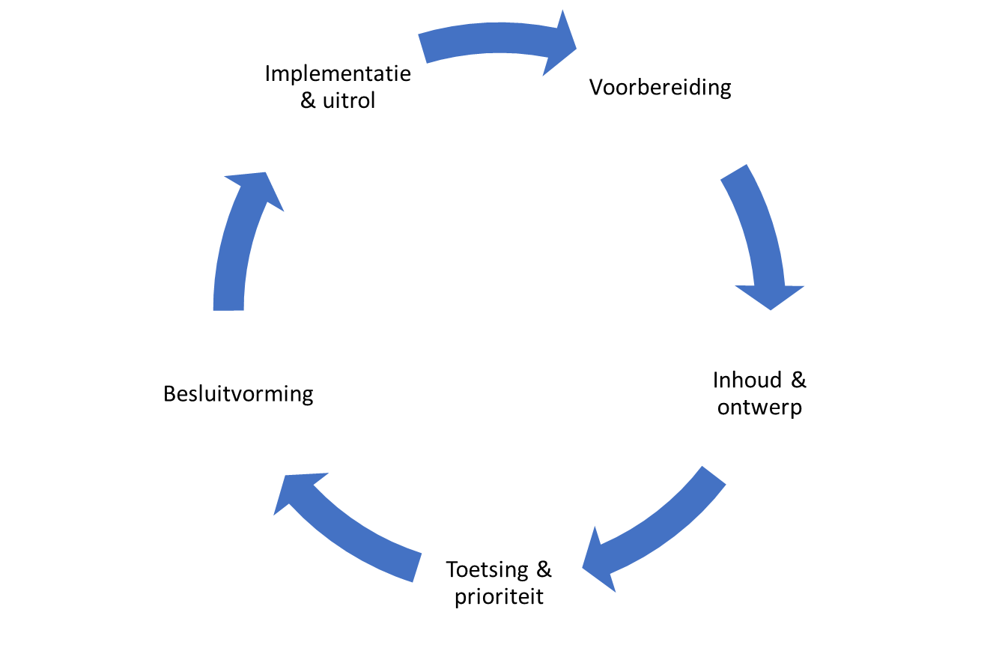

Aanpak en (lange termijn)planning
=================================

Aanpak
------

Het ontwikkelen van de praktijkstandaard Grondwatersensorgegevens (hierna IM
GWSG) gebeurt middels een KEUZE: Waterval- of AGILE-aanpak.

De volgende fasen in de ontwikkeling worden doorlopen.

### Voorbereiding

**Doel:** werkveld op de hoogte brengen van het te ontwikkelen informatiemodel.

**Aanpak:** opstellen scopedocument; aankondigen ontwikkeling praktijkstandaard
via diverse communicatiekanalen, samenstellen van werkgroep met
vertegenwoordigers vanuit alle stakeholders, ophalen (informatie)behoeften bij
stakeholders; inrichten governance t.b.v. regie/sturing en besluitvorming
(middels stuurgroep of begleidingsgroep).

**Resultaat:** lijst met wensen c.q. verbetersuggesties voor het IM GWSG.

**Doorlooptijd:** 3 maanden voor start fase ‘Inhoud & ontwerp’

### Inhoud & ontwerp 

In het Metamodel voor Informatiemodellering worden [vier typen
informatiemodellen](https://docs.geostandaarden.nl/mim/def-st-mim-20201023/#typen-informatiemodellen)
onderscheiden. Voor het IM GWSG wordt uitgegaan van het

#### opstellen van een conceptueel informatiemodel 

**Doel:** vastleggen van de gegevensdefinitie en eisen/principes in een
conceptueel informatiemodel. catalogus, en een uitwisselingsmodel een
conceptueel model

**Aanpak:** in werksessies met materiedeskundigen en één of meer
informatiemodelleurs/data-analisten, de conceptuele behoeften (eventueel
geclusterd in thema’s) vertalen in een gestructureerde gegevensdefinitie
(informatiemodel).

**Resultaat:** *(consultatieversie van de)* Catalogus IM GWSG

**Doorlooptijd:** 6-12 maanden, afhankelijk van de omvang van de
praktijkstandaard, en de complexiteit en convergentie van oplossingsrichtingen.

#### Opstellen van een uitwisselingsmodel

**Doel:** vastleggen van de (technische) eisen voor de uitwisseling van de
gegevens, zoals beschreven in de catalogus IM GWSG.

**Aanpak:** het aanvullen van het conceptuele model met technische elementen ten
behoeve van de uitwisseling; het beschrijven van de uitwisseling / het
berichtenverkeer; het maken van een keuze voor het uitwisselingsformaat
(encoding).

**Resultaat:** Consultatieversie van de Catalogus uitwisselingsformaat/
berichtenverkeer IM GWSG, inclusief bijhorende implementatiebestanden.

**Doorlooptijd:** 0-3 maanden

N.B. Na opstellen conceptueel model volgt doorgaans eerste openbare consultatie.

### Toetsing & prioriteit

#### Consultatie

**Doel:** De resultaten uit fase Inhoud & ontwerp, zijnde het conceptuele model
en uitwisselingsmodel worden openbaar geconsulteerd:

**Aanpak:** In de 1e ronde openbare consultatie van 6 weken mogen alle
belanghebbenden reageren op de consultatieversie (v0.9). Hierna worden de
reacties (meldingen) verwerkt in de consultatieversie. Elke indiener van een
melding ontvangt een terugkoppeling of/hoe zijn melding is verwerkt. De
gewijzigde consultative (v0.91) wordt 2 weken openbaar geconsulteerd. Elke
belanghebbende kan reageren op de wijzigingen ten opzichgte van de 0.9-versie.
Hierna worden de reacties verwerkt in een versie ter vaststelling (v0.99).

**Resultaat:** Versie ter vaststelling van de catalogus IM GWSG

**Doorlooptijd: 2-3 maanden**

#### Proefproductie

**Doel:** testen of het IM GWSG implementeerbaar is.

**Aanpak:** met een compacte kern/kopgroep van gebruikers, afnemers en
softwareleveranciers wordt getest of bestaande data omgezet kan worden naar het
IM GWSG, en testen softwareleveranciers of

**Resultaat:** inzicht in technische haalbaarheid IM GWSG.

**Doorlooptijd:** 0-3 maanden

#### Besluitvorming

**Doel:** Vaststellen IM GWSG

**Aanpak:** n.t.b.

**Resultaat:** Vastgestelde versie 1.0 van IM GWSG

**Doorlooptijd:** PM

### Implementatie & uitrol

#### Implementeren in software

**Doel:** software wordt geïmplementeerd

**Aanpak:** softwareleveranciers implementeren het informatiemodel GWSG in hun
software; op basis van de aangeleverde implementatiebestanden en
voorbeeldbestanden. De beheerder van het IM GWSG is beschikbaar voor
implementatieondersteuning.

**Resultaat:**

**Doorlooptijd:** 3-6 maanden

#### Certificering

**Doel:** toetsen of software voldoet aan de Eisen die het IM GWSG

**Aanpak:** n.t.b., methode van toetsing vastleggen in een toetsprotocol en
toetsdocument met bijbehorende toetsscenario’s/testbestanden.

**Resultaat:** gecertificeerde software

**Doorlooptijd: PM**

#### Uitrol software en aansluiten op keten

Doel:

Aanpak: installeren van de software bij de gebruikers.

Resultaat:

Doorlooptijd: PM

Planning
--------

