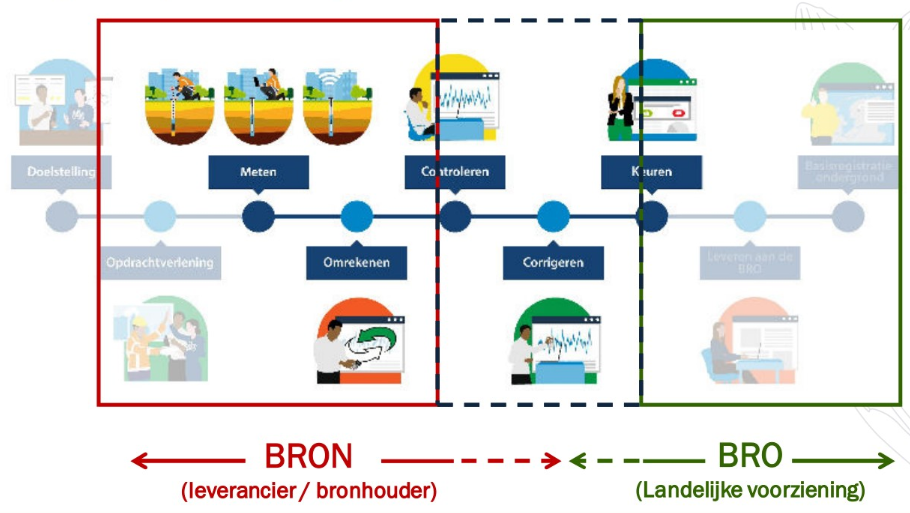
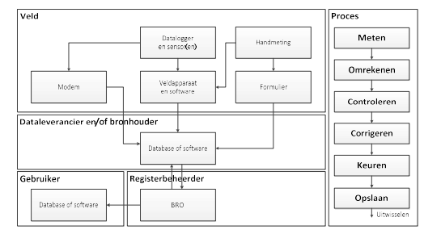

Ketenwerkproces
===============

>   **Ketenwerkproces Grondwaterstandonderzoek (GLD)**

>   Hieronder ziet u een stroomschema van grondwaterstandsgegevens. Links staat
>   de fysieke gegevensstroom vanaf de monitoringbuis en meetinstrumenten in het
>   veld, via de database of software van de dataleverancier of bronhouder naar
>   de BRO. Rechts staan de stappen in het bewerkingsproces, vanaf de originele
>   meting tot aan de definitieve gegevens in de database.

>   In de praktijk is dit vaak geen lineair, chronologisch proces: processtappen
>   worden soms herhaald en ook worden gegevens soms tussentijds opgeslagen. Het
>   proces waarbij gegevens van een grondwaterstandonderzoek ontstaan, verloopt
>   als volgt:

>   1. In een monitoringbuis van een grondwatermonitoringput wordt de
>   grondwaterstand of grondwaterdruk in de buis gemeten met een meetlint en/of
>   sensor. Er zijn drie mogelijke gegevensstromen naar de bronhouder:

>   a. Handmatige meting. Bij gebruik van een meetlint, peilklokje of handmatige
>   akoestische sensor wordt de afstand gemeten vanaf een vooraf ingemeten
>   referentiehoogte (meestal de bovenkant van de monitoringbuis of het
>   sensornulpunt) tot aan de bovenkant van het in de buis aanwezige grondwater.
>   Daarnaast wordt het tijdstip gemeten en vastgelegd. Handmatige metingen
>   worden meestal niet met hoge frequentie uitgevoerd, bijvoorbeeld niet vaker
>   dan eens per twee weken.

>   b. Sensormeting waarbij de gegevens in het veld uitgelezen moeten worden.
>   Bij deze metingen wordt een druksensor in het grondwater gehangen dat in de
>   buis aanwezig is. Periodiek (bijvoorbeeld eens per uur of per dag) wordt de
>   druk van het grondwater boven het nulpunt van de druksensor gemeten. Bij
>   gebruik van absolute sensoren wordt naast de waterdruk in veel gevallen ook
>   de luchtdruk op dat tijdstip gemeten, omdat er luchtdrukcompensatie wordt
>   toegepast (zie 2). De gegevens worden periodiek in het veld uitgelezen,
>   meestal eens per kwartaal of eens per halfjaar.

>   c. Telemetrische sensormeting. Ook hier wordt gewerkt met druksensoren, met
>   dit verschil dat bij deze metingen de gegevens direct, automatisch bij de
>   dataleverancier of bronhouder in de database worden weggeschreven of worden
>   geladen in de software. De verschillende gegevensstromen bestaan naast
>   elkaar. Handmatige metingen vinden bijvoorbeeld altijd ter controle plaats
>   naast de sensormetingen.

>   2. De gemeten druk en de gemeten grondwaterhoogte worden omgerekend naar een
>   grondwaterstand of stijghoogte ten opzichte van een vast referentiepunt. Bij
>   absolute druksensoren wordt ook een luchtdrukcompensatie uitgevoerd (met de
>   lokaal gemeten luchtdruk of met luchtdrukmetingen van het KNMI). De
>   omrekening gebeurt in sommige gevallen in de software die bij de sensor
>   hoort. In andere gevallen vindt omrekening in een latere fase plaats,
>   bijvoorbeeld in de database bij de dataleverancier of bronhouder.

>   3. Er ontstaat zo een tijdreeks van periodieke grondwaterstands- of
>   stijghoogtemetingen. De kwaliteit van deze metingen wordt, na ontvangst door
>   de bronhouder en/of een adviesbureau, meestal gecontroleerd op fouten en
>   afwijkingen – onder meer aan de hand van andere beschikbare (meet)gegevens.
>   In het bijzonder wordt het functioneren van de sensor gecontroleerd met de
>   handmatige controlemetingen.

>   4. Zo nodig worden systematische afwijkingen van de druksensor en/of klok
>   van de datalogger gecorrigeerd. De controles en correcties van stappen 3 en
>   4 worden veelal uitgevoerd op basis van een controleprotocol.

>   5. De uitkomsten van het controle- en correctieproces (stappen 3 en 4)
>   worden vastgelegd, en leiden tot een keuring die uitmondt in een Status
>   kwaliteitscontrole, dat een eindoordeel geeft over de bruikbaarheid van het
>   gegeven. De drie gegevensstromen (handmatig, sensor en telemetrisch) hebben
>   een verschillende dynamiek in de aanvoer van gegevens.

>   Het BRO-standaardisatieteam stelt tijdens de standaardisatiefase vast, welke
>   meetreeksen gekeurd worden en wanneer, en of dit overeenkomt met de
>   wettelijk vastgestelde aanlevertermijn. De precieze invulling van de
>   processtappen hangt in de praktijk vaak af van het onderzoeksdoel en het
>   toepassingsgebied. Zo is het bij regionaal grondwaterbeheer bijvoorbeeld
>   belangrijk om de absolute grondwaterstand of stijghoogte te kennen, terwijl
>   in geotechnische toepassingen kennis over de fluctuatie van de
>   grondwaterstand vaak voldoende is.

>   [Bron: Scopedocument BRO Registratieobject Grondwaterstandonderzoek
>   (GLD)](https://www.bro-productomgeving.nl/bpo/files/latest/88545864/88545865/1/1608135252302/Scopedocument+Grondwaterstandonderzoek+GLD+versie+1.21.pdf)

>   **Ketenwerkproces Grondwatermonitoringnet (GMN)**

>   In de huidige werkwijze van het monitoren van grondwater wordt het begrip
>   monitoringnet -of nog vaker meetnet- door veel stakeholders gebruikt om de
>   verzameling putten of peilbuizen van een bepaalde eigenaar/bestuursorgaan
>   aan te duiden. Tegelijkertijd wordt (door andere stakeholders, zoals
>   provincies) bij het begrip monitoringnet ook onderkend dat filters
>   toebehoren aan verschillende eigenaren. In een (beperkt) aantal gevallen
>   (bijvoorbeeld een KRW-net of bepaalde, aan specifieke projecten
>   gerelateerde, netten) vindt de afbakening van een ‘net’ ook plaats op basis
>   van het doel en/of wettelijk kader.

>   De registratie van deze afbakening is meestal niet expliciet. De samenhang
>   van de meetlocaties beperkt zich vaak tot de projectkaders van het
>   bestuursorgaan. In het geval van de KRW-monitoringnetten worden
>   grondwaterstand- en/of grondwaterkwaliteitsgegevens uit de, in
>   meetprogramma’s gedefinieerde, meetpunten van deze KRW monitoringnetten in
>   samenhang beoordeeld. Vervolgens wordt, in een nadere analyse, de
>   grondwatertoestand op basis van de aldus verkregen gegevenssets en andere
>   informatie en kennis beschreven en gerapporteerd aan de EU. Vanuit het
>   Ministerie van I&W (DG Ruimte en Water) lopen momenteel inventariserende
>   onderzoeken naar de verschillende meetnetten die in Nederland voorkomen. Het
>   RIVM inventariseert grondwaterkwaliteitsmeetnetten, terwijl TNO-GDN
>   bestaande grondwaterkwantiteitsmeetnetten op een rij zet. De resultaten van
>   deze inventarisaties zullen worden gebruikt voor de verdere standaardisatie
>   van dit registratieobject.

>   [Bron: Scopedocument BRO Registratieobject Grondwatermonitoringnet
>   (GMN)](https://www.bro-productomgeving.nl/bpo/files/latest/88545848/88545850/1/1608134849275/20190701_scope_doc_grondwatermonitoringnet_gmn_1_2_1+%282%29.pdf)
