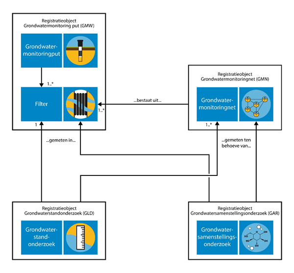

Relevante standaarden
=====================

1.  Basisregistratie Ondergrond Grondwatermonitoring (GMN)
    <https://docs.geostandaarden.nl/bro/gmn/> , versie 2 juli 2020

2.  Basisregistratie Ondergrond Catalogus Grondwaterstandonderzoek (GLD)

<https://docs.geostandaarden.nl/bro/gld/> , versie 2 juli 2020

1.  OGC Observation & measurements (<https://www.ogc.org/standards/om> )

2.  OGC WaterML <https://www.ogc.org/standards/waterml>

